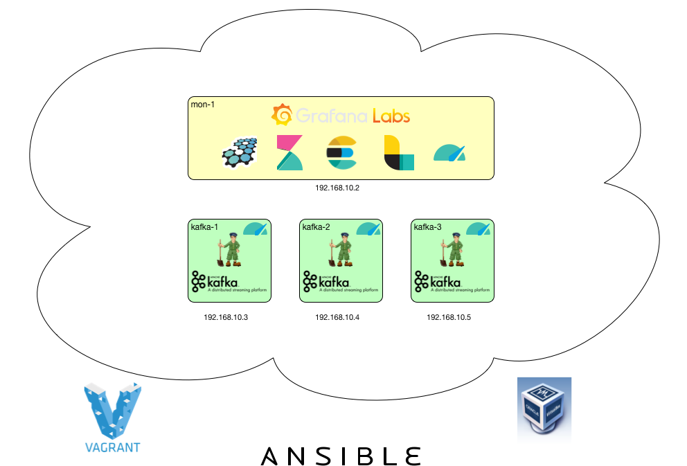
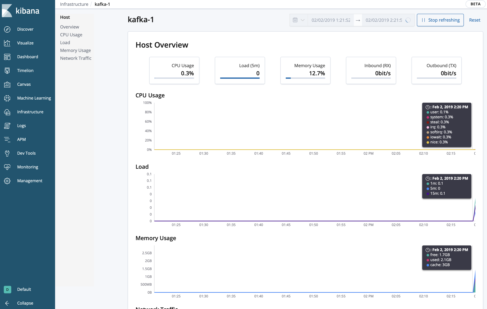
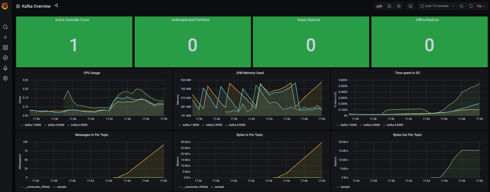
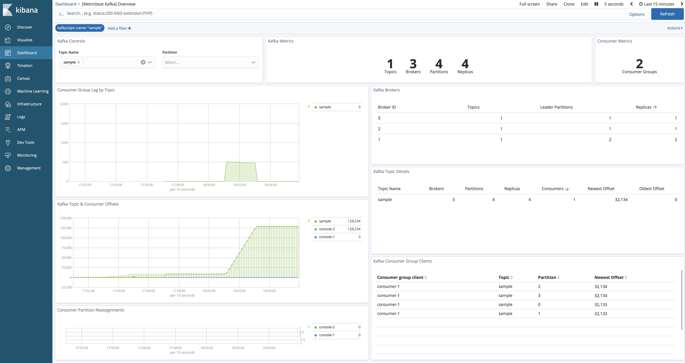
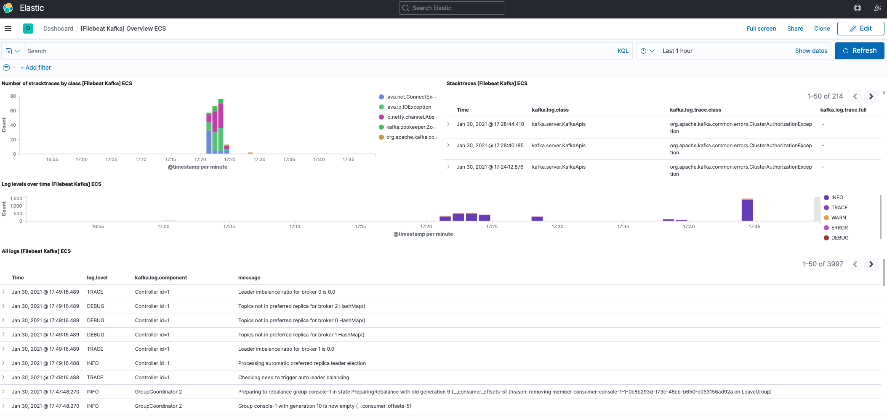

# Kafka Data Cluster

## Content

In case you need a local cluster providing Kafka (**with SSL and ACL**) including a monitoring suite.

* [Apache Kafka 2.8.0](http://kafka.apache.org/28/documentation.html)
* [Elasticsearch 7.14.1](https://www.elastic.co/guide/en/elasticsearch/reference/7.14/index.html)
* [Kibana 7.14.1](https://www.elastic.co/guide/en/kibana/7.14/index.html)
* [Filebeat 7.14.1](https://www.elastic.co/guide/en/beats/filebeat/7.14/index.html)
* [Metricbeat 7.14.1](https://www.elastic.co/guide/en/beats/metricbeat/7.14/index.html)
* [Grafana 8.1.4](https://grafana.com)
* [Prometheus 2.30.0](https://prometheus.io)

## AWS Version

see [AWS](AWS.md)

## Prerequisites

* [Vagrant](https://www.vagrantup.com) (tested with 2.2.18)
* [VirtualBox](http://virtualbox.org) (tested with 6.1.26)
* [Ansible](http://docs.ansible.com/ansible/index.html) (tested with 4.5.0)
* The VMs take approx 15 GB of RAM, so you should have more than that.


:warning: Vagrant might ask you for your admin password. The reason behind is, that `vagrant-hostsupdater` is used to have the vms available with their names in your network.

## Init

```bash
git clone https://github.com/markush81/kafka-cluster.git
vagrant up
```

## Cluster

The result if everything wents fine should be




## Coordinates

#### Servers

| IP | Hostname | Description | Settings |
|:--- |:-- |:-- |:-- |
|192.168.10.2|mon-1|running elk and metricbeat | 4096 MB RAM |
|192.168.10.3|mon-2|running grafana, prometheus and metricbeat | 2048 MB RAM |
|192.168.10.4|kafka-1|running a zookeeper, kafka broker and metricbeat | 2048 MB RAM |
|192.168.10.5|kafka-2|running a zookeeper, kafka broker and metricbeat | 2048 MB RAM |
|192.168.10.6|kafka-3|running a zookeeper, kafka broker and metricbeat | 2048 MB RAM |


### Connections

| Name | |
|:-- |:-- |
|Zookeeper|kafka-1:2182,kafka-2:2182,kafka-3:2182|
|Kafka Brokers|kafka-1:9093,kafka-2:9093,kafka-3:9093|
|Kibana|[http://mon-1:5601](http://mon-1:5601)|
|Elasticsearch|[http://mon-1:9200](http://mon-1:9200)|
|Grafana|[http://mon-2:3000](http://mon-2:3000)|
|Prometheus|[http://mon-2:9090](http://mon-2:9090)|

# Monitoring

## System Overview

#### Kibana Infrastructure





## Kafka Overview

#### Gathered with Prometheus Agent from Kafka Brokers.



#### Kibana Metricbeat



#### Kibana Logs



# Usage

## Zookeeper

```bash
vagrant ssh kafka-1

zookeeper-shell.sh -zk-tls-config-file /vagrant/exchange/ssl-client/client-zookeeper-ssl.properties kafka-1:2182/

Connecting to kafka-1:2182/
...

WATCHER::

WatchedEvent state:SyncConnected type:None path:null
[zk: zookeeper-1:2182,zookeeper-3:2182(CONNECTED) 0] ls /
[cluster, controller, controller_epoch, brokers, zookeeper, admin, isr_change_notification, consumers, config]
[zk: zookeeper-1:2182,zookeeper-3:2182(CONNECTED) 1]

```

## Kafka

### Topic Creation

```bash
vagrant ssh kafka-1

kafka-acls.sh --zk-tls-config-file /vagrant/exchange/ssl-client/client-zookeeper-ssl.properties --authorizer-properties zookeeper.connect=kafka-1:2182 --add --operation Create --cluster --allow-principal User:CN=kafka,OU=org,O=org,L=home,ST=Bavaria,C=DE

kafka-acls.sh --zk-tls-config-file /vagrant/exchange/ssl-client/client-zookeeper-ssl.properties --authorizer-properties zookeeper.connect=kafka-1:2182 --add --operation Create --topic '*' --allow-principal User:CN=kafka,OU=org,O=org,L=home,ST=Bavaria,C=DE

kafka-acls.sh --zk-tls-config-file /vagrant/exchange/ssl-client/client-zookeeper-ssl.properties --authorizer-properties zookeeper.connect=kafka-1:2182 --add --operation Describe --topic '*' --allow-principal User:CN=kafka,OU=org,O=org,L=home,ST=Bavaria,C=DE

kafka-acls.sh --zk-tls-config-file /vagrant/exchange/ssl-client/client-zookeeper-ssl.properties --authorizer-properties zookeeper.connect=kafka-1:2182 --add --operation DescribeConfigs --topic '*' --allow-principal User:CN=kafka,OU=org,O=org,L=home,ST=Bavaria,C=DE
```

```bash
kafka-topics.sh --command-config /vagrant/exchange/ssl-client/client-broker-ssl.properties --bootstrap-server kafka-1:9093 --create --replication-factor 1 --partitions 4 --topic sample

```

```bash
Created topic "sample".
```

```bash
kafka-topics.sh --command-config /vagrant/exchange/ssl-client/client-broker-ssl.properties --bootstrap-server kafka-1:9093 --topic sample --describe
```

```bash
Topic: sample	PartitionCount: 4	ReplicationFactor: 1	Configs: flush.ms=1000,segment.bytes=1073741824
	Topic: sample	Partition: 0	Leader: 0	Replicas: 0	Isr: 0
	Topic: sample	Partition: 1	Leader: 2	Replicas: 2	Isr: 2
	Topic: sample	Partition: 2	Leader: 1	Replicas: 1	Isr: 1
	Topic: sample	Partition: 3	Leader: 0	Replicas: 0	Isr: 0
```

### ACL for producers and consumers

```bash
kafka-acls.sh --zk-tls-config-file /vagrant/exchange/ssl-client/client-zookeeper-ssl.properties --authorizer-properties zookeeper.connect=kafka-1:2182 --add --producer --topic sample --allow-principal User:CN=kafka,OU=org,O=org,L=home,ST=Bavaria,C=DE

kafka-acls.sh --zk-tls-config-file /vagrant/exchange/ssl-client/client-zookeeper-ssl.properties --authorizer-properties zookeeper.connect=kafka-1:2182 --add --consumer --topic sample --allow-principal User:CN=kafka,OU=org,O=org,L=home,ST=Bavaria,C=DE  --group console --resource-pattern-type PREFIXED
```

```bash
kafka-acls.sh --zk-tls-config-file /vagrant/exchange/ssl-client/client-zookeeper-ssl.properties --authorizer-properties zookeeper.connect=kafka-1:2182 --list

```

```bash
Current ACLs for resource `ResourcePattern(resourceType=GROUP, name=console, patternType=PREFIXED)`:
 	(principal=User:CN=kafka,OU=org,O=org,L=home,ST=Bavaria,C=DE, host=*, operation=READ, permissionType=ALLOW)

Current ACLs for resource `ResourcePattern(resourceType=CLUSTER, name=kafka-cluster, patternType=LITERAL)`:
 	(principal=User:CN=kafka,OU=org,O=org,L=home,ST=Bavaria,C=DE, host=*, operation=CLUSTER_ACTION, permissionType=ALLOW)
	(principal=User:CN=kafka,OU=org,O=org,L=home,ST=Bavaria,C=DE, host=*, operation=DESCRIBE, permissionType=ALLOW)
	(principal=User:CN=kafka,OU=org,O=org,L=home,ST=Bavaria,C=DE, host=*, operation=CREATE, permissionType=ALLOW)

Current ACLs for resource `ResourcePattern(resourceType=TOPIC, name=*, patternType=LITERAL)`:
 	(principal=User:CN=kafka,OU=org,O=org,L=home,ST=Bavaria,C=DE, host=*, operation=CREATE, permissionType=ALLOW)
	(principal=User:CN=kafka,OU=org,O=org,L=home,ST=Bavaria,C=DE, host=*, operation=DESCRIBE, permissionType=ALLOW)
	(principal=User:CN=kafka,OU=org,O=org,L=home,ST=Bavaria,C=DE, host=*, operation=DESCRIBE_CONFIGS, permissionType=ALLOW)

Current ACLs for resource `ResourcePattern(resourceType=TOPIC, name=__consumer_offsets, patternType=LITERAL)`:
 	(principal=User:CN=kafka,OU=org,O=org,L=home,ST=Bavaria,C=DE, host=*, operation=DESCRIBE, permissionType=ALLOW)

Current ACLs for resource `ResourcePattern(resourceType=TOPIC, name=sample, patternType=PREFIXED)`:
 	(principal=User:CN=kafka,OU=org,O=org,L=home,ST=Bavaria,C=DE, host=*, operation=DESCRIBE, permissionType=ALLOW)
	(principal=User:CN=kafka,OU=org,O=org,L=home,ST=Bavaria,C=DE, host=*, operation=READ, permissionType=ALLOW)

Current ACLs for resource `ResourcePattern(resourceType=TOPIC, name=sample, patternType=LITERAL)`:
 	(principal=User:CN=kafka,OU=org,O=org,L=home,ST=Bavaria,C=DE, host=*, operation=WRITE, permissionType=ALLOW)
	(principal=User:CN=kafka,OU=org,O=org,L=home,ST=Bavaria,C=DE, host=*, operation=CREATE, permissionType=ALLOW)
	(principal=User:CN=kafka,OU=org,O=org,L=home,ST=Bavaria,C=DE, host=*, operation=DESCRIBE, permissionType=ALLOW)
```

### Producer

```bash
kafka-console-producer.sh --broker-list kafka-1:9093,kafka-3:9093 --producer.config /vagrant/exchange/ssl-client/client-broker-ssl.properties --topic sample

Hey, is Kafka up and running?
```

### Consumer

```bash
kafka-console-consumer.sh --bootstrap-server kafka-1:9093,kafka-3:9093 --consumer.config /vagrant/exchange/ssl-client/client-broker-ssl.properties  --group console-1 --topic sample --from-beginning

Hey, is Kafka up and running?
```

### Producer Perf Test

```bash
kafka-producer-perf-test.sh --producer.config /vagrant/exchange/ssl-client/client-broker-ssl.properties --producer-props bootstrap.servers="kafka-1:9093,kafka-2:9093,kafka-3:9093" --topic sample --num-records 2000 --throughput 100 --record-size 256

```
