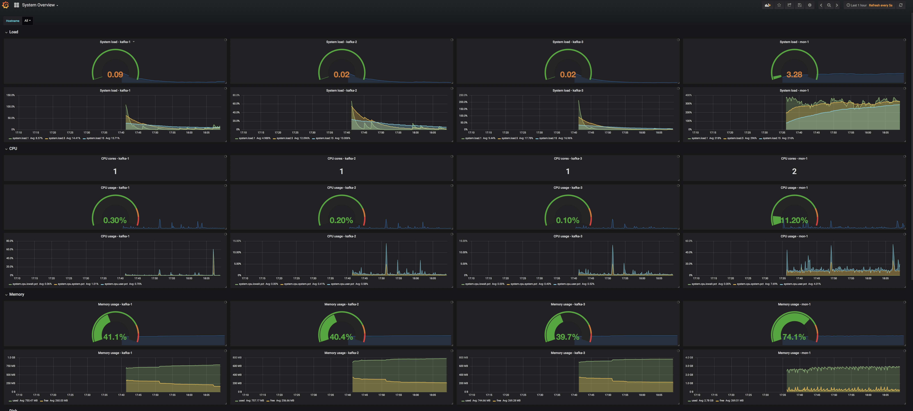
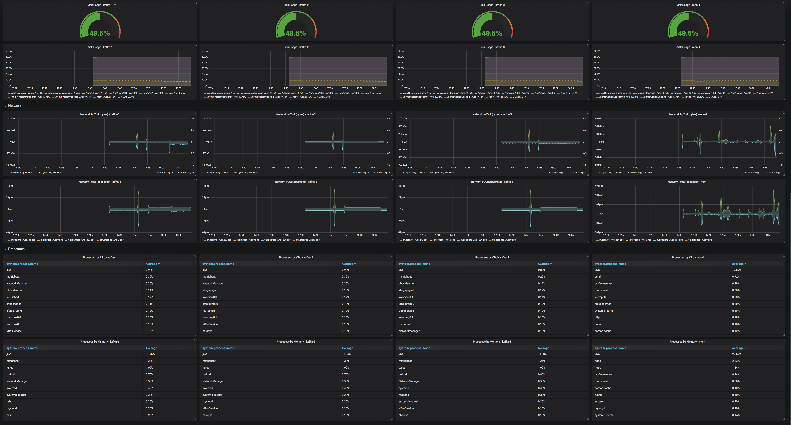

# Kafka Data Cluster

## Content

In case you need a local cluster providing Kafka (**with SSL and ACL**) including a monitoring suite.

* [Apache Kafka 2.0.0](http://kafka.apache.org/20/documentation.html)
* [Elastic Search 6.3.2](https://www.elastic.co/guide/en/elasticsearch/reference/6.3/index.html)
* [Logstash 6.3.2](https://www.elastic.co/guide/en/logstash/6.3/index.html)
* [Kibana 6.3.2](https://www.elastic.co/guide/en/kibana/6.3/index.html)
* [Grafana 5.2.2](https://grafana.com)
* [Graphite](https://graphiteapp.org)
* [Prometheus 2.2.1](https://prometheus.io)
* [Jmxtrans Agent 1.2.6](https://github.com/jmxtrans/jmxtrans-agent/)

## Prerequisites

* [Vagrant](https://www.vagrantup.com) (tested with 2.1.2)
* [VirtualBox](http://virtualbox.org) (tested with 5.2.16)
* [Ansible](http://docs.ansible.com/ansible/index.html) (tested with 2.6.2)
* The VMs take approx 13 GB of RAM, so you should have more than that.


:warning: Vagrant might ask you for your admin password. The reason behind is, that `vagrant-hostsupdater` is used to have the vms available with their names in your network.

## Init

```bash
git clone https://github.com/markush81/kafka-cluster.git
vagrant up
```

## Cluster

The result if everything wents fine should be


## Coordinates

#### Servers

| IP | Hostname | Description | Settings |
|:--- |:-- |:-- |:-- |
|192.168.10.2|mon-1|running elk and metricbeat| 4096 MB RAM |
|192.168.10.3|mon-2|running grafana, graphite and metricbeat| 1536 MB RAM |
|192.168.10.4|mon-3|running prometheus and metricbeat| 1536 MB RAM |
|192.168.10.5|kafka-1|running a kafka broker and metricbeat| 2048 MB RAM |
|192.168.10.6|kafka-2|running a kafka broker and metricbeat| 2048 MB RAM |
|192.168.10.7|kafka-3|running a kafka broker and metricbeat| 2048 MB RAM |


### Connections

| Name |  |
|:-- |:-- |
|Zookeeper|kafka-1:2181,kafka-2:2181,kafka-3:2181|
|Kafka Brokers|kafka-1:9093,kafka-2:9093,kafka-3:9093|
|Kibana|[http://mon-1:5601](http://mon-1:5601)|
|Elasticsearch|[http://mon-1:9200](http://mon-1:9200)|
|Grafana|[http://mon-2:3000](http://mon-2:3000)|
|Graphite|[http://mon-2](http://mon-2)|
|Prometheus (graph)|[http://mon-3:9090/graph](http://mon-3:9090/graph)|


# Monitoring

## System Overview




## Kafka Overview


# Usage

## Zookeeper

```bash
lucky:~ markus$ vagrant ssh kafka-1
[vagrant@kafka-1 ~]$ zkCli.sh -server kafka-1:2181/
Connecting to kafka-1:2181/
...

WATCHER::

WatchedEvent state:SyncConnected type:None path:null
[zk: zookeeper-1:2181,zookeeper-3:2181(CONNECTED) 0] ls /
[cluster, controller, controller_epoch, brokers, zookeeper, admin, isr_change_notification, consumers, config]
[zk: zookeeper-1:2181,zookeeper-3:2181(CONNECTED) 1]

```

## Kafka

### ACL for cluster operations

```bash
lucky:~ markus$ vagrant ssh kafka-1

[vagrant@kafka-1 ~]$ KAFKA_OPTS=-Djava.security.auth.login.config=/usr/local/kafka_2.12-2.0.0/config/zookeeper_jaas.conf kafka-acls.sh --authorizer-properties zookeeper.connect=localhost:2181 --add --operation ClusterAction --cluster --allow-principal User:CN=kafka,OU=org,O=org,L=home,ST=Bavaria,C=DE
```

### Topic Creation

```bash
lucky:~ markus$ vagrant ssh kafka-1

[vagrant@kafka-1 ~]$ KAFKA_OPTS=-Djava.security.auth.login.config=/usr/local/kafka_2.12-2.0.0/config/zookeeper_jaas.conf kafka-acls.sh --authorizer-properties zookeeper.connect=localhost:2181 --add --operation Create --cluster --allow-principal User:CN=kafka,OU=org,O=org,L=home,ST=Bavaria,C=DE
[vagrant@kafka-1 ~]$ KAFKA_OPTS=-Djava.security.auth.login.config=/usr/local/kafka_2.12-2.0.0/config/zookeeper_jaas.conf kafka-acls.sh --authorizer-properties zookeeper.connect=localhost:2181 --add --operation Describe --cluster --allow-principal User:CN=kafka,OU=org,O=org,L=home,ST=Bavaria,C=DE

[vagrant@kafka-1 ~]$ KAFKA_OPTS=-Djava.security.auth.login.config=/usr/local/kafka_2.12-2.0.0/config/zookeeper_jaas.conf kafka-topics.sh --create --zookeeper kafka-1:2181 --replication-factor 2 --partitions 6 --topic sample
Created topic "sample".

[vagrant@kafka-1 ~]$ KAFKA_OPTS=-Djava.security.auth.login.config=/usr/local/kafka_2.12-2.0.0/config/zookeeper_jaas.conf kafka-topics.sh --zookeeper kafka-1:2181 --topic sample --describe
Topic:sample	PartitionCount:6	ReplicationFactor:2	Configs:
	Topic: sample	Partition: 0	Leader: 1	Replicas: 1,2	Isr: 1,2
	Topic: sample	Partition: 1	Leader: 2	Replicas: 2,3	Isr: 2,3
	Topic: sample	Partition: 2	Leader: 3	Replicas: 3,1	Isr: 3,1
	Topic: sample	Partition: 3	Leader: 1	Replicas: 1,3	Isr: 1,3
	Topic: sample	Partition: 4	Leader: 2	Replicas: 2,1	Isr: 2,1
	Topic: sample	Partition: 5	Leader: 3	Replicas: 3,2	Isr: 3,2
[vagrant@kafka-1 ~]$
```

### ACL for producers and consumers

```bash
[vagrant@kafka-1 ~]$ KAFKA_OPTS=-Djava.security.auth.login.config=/usr/local/kafka_2.12-2.0.0/config/zookeeper_jaas.conf kafka-acls.sh --authorizer-properties zookeeper.connect=localhost:2181 --add --producer --topic sample --allow-principal User:CN=kafka,OU=org,O=org,L=home,ST=Bavaria,C=DE

[vagrant@kafka-1 ~]$ KAFKA_OPTS=-Djava.security.auth.login.config=/usr/local/kafka_2.12-2.0.0/config/zookeeper_jaas.conf kafka-acls.sh --authorizer-properties zookeeper.connect=localhost:2181 --add --consumer --topic sample --allow-principal User:CN=kafka,OU=org,O=org,L=home,ST=Bavaria,C=DE --group console

[vagrant@kafka-1 ~]$ KAFKA_OPTS=-Djava.security.auth.login.config=/usr/local/kafka_2.12-2.0.0/config/zookeeper_jaas.conf kafka-acls.sh --authorizer-properties zookeeper.connect=localhost:2181 --list
```

### Producer

```bash
[vagrant@kafka-1 ~]$ kafka-console-producer.sh --broker-list kafka-1:9093,kafka-3:9093 --producer.config /vagrant/exchange/ssl-client/client-ssl.properties --topic sample
Hey, is Kafka up and running?
```

### Consumer

```bash
[vagrant@kafka-1 ~]$ kafka-console-consumer.sh --bootstrap-server kafka-1:9093,kafka-3:9093 --consumer.config /vagrant/exchange/ssl-client/client-ssl.properties  --group console --topic sample --from-beginning
Hey, is Kafka up and running?
```

### Producer Perf Test

```bash
[vagrant@kafka-1 ~]$ kafka-producer-perf-test.sh --producer.config /vagrant/exchange/ssl-client/client-ssl.properties --producer-props bootstrap.servers="kafka-1:9093,kafka-2:9093,kafka-3:9093" --topic sample --num-records 2000 --throughput 100 --record-size 256

```
